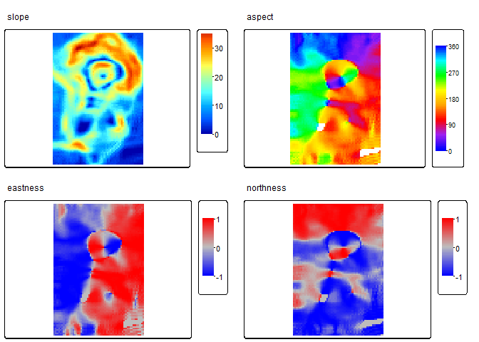
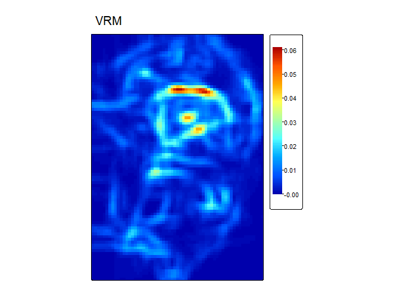
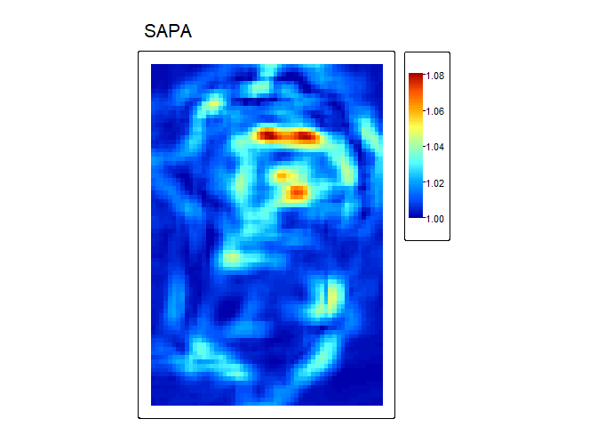
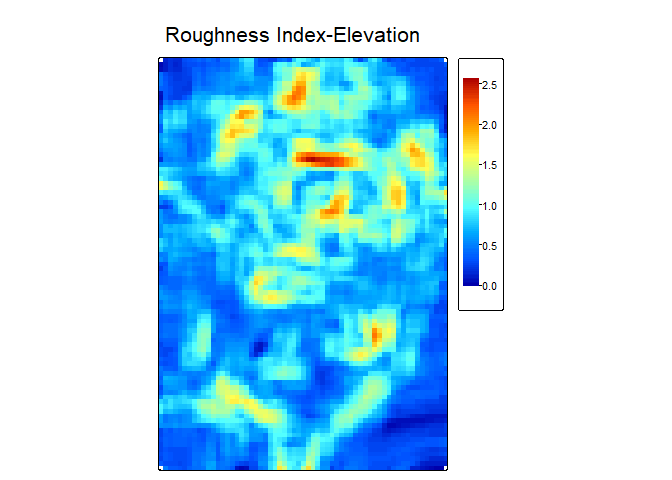
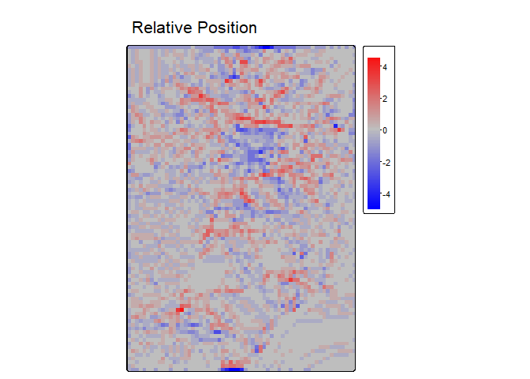
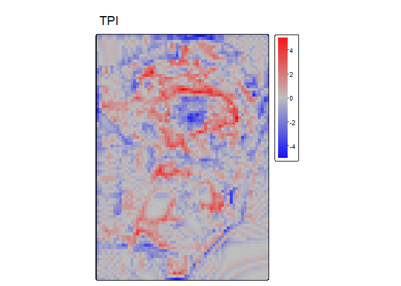
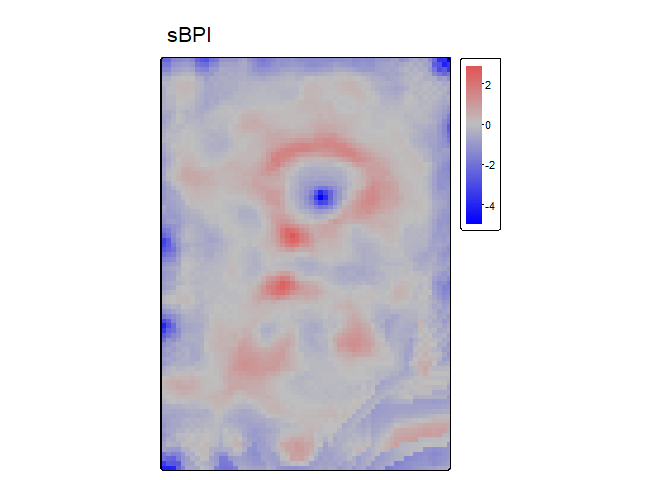

README
================
Alexander Ilich
September 12, 2023

# MultiscaleDTM

<!-- badges: start -->

[](https://github.com/ailich/MultiscaleDTM/actions/workflows/R-CMD-check.yaml)
[](https://cran.r-project.org/package=MultiscaleDTM)
[](https://www.gnu.org/licenses/gpl-3.0)
[](https://zenodo.org/badge/latestdoi/353158828)
<!-- badges: end -->

Please cite as

Ilich, A. R., Misiuk, B., Lecours, V., & Murawski, S. A. (2023).
MultiscaleDTM: An open-source R package for multiscale geomorphometric
analysis. *Transactions in GIS*, *27*(4).
<https://doi.org/10.1111/tgis.13067>

## Purpose

This R package calculates multi-scale geomorphometric terrain attributes
from regularly gridded digital terrain models (DTM; i.e. elevation or
bathymetry rasters) via a specified window as described in [Ilich et
al. (2023)](http://doi.org/10.1111/tgis.13067).


Figure adapted from Wilson et al. (2007)

## Install and Load Package

The package can be installed from CRAN using
`install.packages("MultiscaleDTM")` or the development version can be
installed from github using the code
`remotes::install_github("ailich/MultiscaleDTM")`. If you are using
Windows, you may need to install Rtools using the instructions found
[here](https://cran.r-project.org/bin/windows/Rtools/)). To install from
github you must already have the remotes package installed, which can be
installed using `install.packages("remotes")`

This package relies on the `terra` package for handling of spatial
raster data.

## Main Functions

### Slope, Aspect and Curvature

- `SlpAsp` calculates multi-scale slope and aspect according to Misiuk
  et al (2021) which is a modification of the traditional 3 x 3 slope
  and aspect algorithms (Fleming and Hoffer, 1979; Horn et al., 1981;
  Ritter, 1987). This algorithm only considers a subset of cells within
  the focal window, specifically the four cells on the edge of the focal
  window directly up, down, left, and right of the focal cell for the
  “rook” case and an additional four corner cells for the “queen” case.
  

- `Qfit` calculates slope, aspect, curvature, and morphometric features
  by fitting a quadratic surface to the focal window using ordinary
  least squares using the equation shown below where a-f are regression
  parameters, Z is the elevation/depth, X is the east/west coordinates
  in the focal window relative to the focal cell, and Y is the
  north/south coordinates in the focal window relative to the focal cell
  (Evans, 1980; Wilson et al., 2007; Wood, 1996). The morphometric
  features algorithm has been modified to use more robust measures of
  curvature based on the suggestions of Minár et al. (2020).

$$
Z = aX^2 + bY^2 +cXY+ dX +eY +f
$$


Figure adapted from Walbridge et al., (2018)

### Roughness

- `VRM` - Vector ruggedness measure (Sappington et al. 2007) quantifies
  roughness by measuring the dispersion of vectors normal to the terrain
  surface. This is accomplished by calculating the local (3 x 3 cell)
  slope and aspect, and constructing unit vectors normal to each cell in
  the DTM. These unit vectors are then decomposed into their
  corresponding x, y, and z components (i.e. the x, y, and z coordinates
  of the head of the vector relative to its origin) and used in the
  following equation (note: N is the number of cells in the window). VRM
  ranges from zero to one, representing completely smooth to rough
  surfaces, respectively. .


Figure adapted from Sappington et al. (2007)


Figure adapted from Habib (2021)

$$
\text{VRM} = 1- \frac{\sqrt{\bigg(\sum x\bigg)^2+\bigg(\sum y\bigg)^2+\bigg(\sum z\bigg)^2}}{N}
$$

$$
x = sin(\text{slope})*sin(\text{aspect})
$$

$$
y=sin(\text{slope})*cos(\text{aspect})
$$

$$
z=cos(\text{slope})
$$

- `SAPA` - Calculates the Surface Area to Planar Area (Jenness, 2004).
  Rougher surfaces will have a greater surface area to planar area
  ratio, and perfectly smooth surfaces will have a value of 1. This is a
  3D analog to the classical “chain-and-tape” method, which calculates
  roughness as the ratio of the contoured distance (chain length) and
  linear distance (tape measure distance; Risk, 1972). Additionally,
  planar area can be corrected for slope by dividing the product of the
  x and y resolution by the cosine of slope (Du Preez 2015). The metric
  by Jenness (2004) and De Preez (2015) works at the per cell level (1x1
  cell). This function generalizes this method to multiple scales by
  summing the surface areas within the focal window and adjusting the
  planar area of the focal window using multi-scale slope (Ilich et al.,
  2023).

  - `SurfaceArea` - Calculate the surface area of each grid cell
    (Jenness, 2004). This is accomplished by connecting a focal cell to
    its immediate neighbors to create 8 large triangles. These large
    triangles are then trimmed back to the extent of the focal cell
    using the principle of similar triangles, and then the area of those
    8 smaller triangles are calculated and summed to estimate the
    surface area of the focal pixel. This is used within `SAPA`.


Figure adapted from Friedman et al. (2012) and created with
BioRender.com.


Figure adapted from Jenness (2004)

- `AdjSD`- This roughness metric modifies the standard deviation of
  elevation/bathymetry to account for slope (Ilich et al., 2023). It
  does this by first fitting a plane to the data in the focal window
  using ordinary least squares, and then extracting the residuals, and
  then calculating the standard deviation of the residuals within the
  focal window.


- `RIE` - Calculates the Roughness Index-Elevation which quantifies the
  standard deviation of residual topography (Cavalli et al., 2008). This
  measure is conceptually similar to `AdjSD` but rather than fitting a
  plane and extracting residuals for the entire focal window, residual
  topography is calculated as the focal pixel minus the focal mean. Then
  the local standard deviation is calculated from this residual
  topography using a focal filter.


Figure adapted from Cavalli et al. (2008)

### Relative Position

Relative position represents whether an area is a local high or low in
relation to a reference height. It is calculated as the value of the
focal cell minus the value of a reference elevation which is often the
mean of included values in the focal window but could also be other
functions such as the median, min, or max of included values. Positive
values indicate local topographic highs and negative values indicate
lows.Relative Position can be expressed in units of the input DTM raster
or can standardized relative to the local topography by dividing by the
standard deviation or range of included elevation values in the focal
window.

- `RelPos` - A flexible and general purpose function to calculate
  relative position using a rectangular, circular, annulus, or custom
  shaped focal window and various functions of the included values as
  the reference height All other relative position functions are calls
  to `RelPos` with different default parameter values.

- `TPI` - Topographic Position Index (Weiss, 2001) is the difference
  between the value of a focal cell and the mean of the surrounding
  cells (i.e. the central cell is excluded from focal opertaions) within
  a rectangular or circular focal window.

- `DMV` - Difference from Mean Value (Lecours et al., 2017; Wilson, and
  Gallant, 2000) is the difference between the value of a focal cell and
  the mean of all cells (i.e. including the focal cell) in a rectangular
  or circular focal window.

- `BPI` - Bathymetric Position Index (Lundblad et al., 2006) is the
  difference between the value of a focal cell and the mean of the
  surrounding cells contained within an annulus shaped window. Since an
  annulus shaped window is used, it requires an inner and outer radius
  to be specified. Although the name contains “bathymetric,” that is due
  to the context in which it was proposed, and is equally applicable to
  terrestrial elevation data.


Examples of different focal window shapes. Shown are a 13 x 13 cell
rectangular window (left), a circular window with a radius of six cells
(center), and an annulus window with an inner radius of four cells and
an outer radius of six cells (right).

## Tutorial

In this tutorial we will calculate most terrain attributes using a 5 x 5
cell rectangular window; however, any rectangular odd numbered window
size could be used. Window size is specified using the `w` parameter.
Rectangular window sizes are specified with a vector of length 2 as
`c(n_rows, n_cols)`. If a single number is provided it will be used for
both the number of rows and columns. Functions that calculate relative
position currently support other focal window shapes. In those examples,
we will additionally calculate the measures using a circular focal
window with a radius of 2 cells, an annulus window with an inner radius
of 4 and an outer radius of 6 cells, and a custom focal window. Circular
windows are specified by a single number representing the radius,
annulus windows are specified with a vector of length 2 of
`c(inner_radius, outer_radius)`, and custom windows are specified by a
matrix with values showing which data to include (1’s) and which data to
exclude (NA’s).

**Load packages**

``` r
library(MultiscaleDTM) #Load MultiscaleDTM package
```

**See package help page**

``` r
help(package="MultiscaleDTM")
```

**Read in Data**

Typically raster data would be loaded into R via `terra` package’s
`rast` function. We will use instead load a georeferenced version of R’s
built in volcano data set using the `erupt` function.

``` r
r<- erupt()
```

<!-- -->

### Slope, Aspect, and Curvature

``` r
slp_asp<- SlpAsp(r = r, w = c(5,5), unit = "degrees", method = "queen", metrics = c("slope", "aspect", "eastness", "northness"), na.rm=TRUE)
```

<!-- -->

``` r
qmetrics<- Qfit(r, w = c(5,5), unit = "degrees", metrics = c("elev", "qslope", "qaspect", "qeastness", "qnorthness", "profc", "planc", "twistc", "meanc", "maxc", "minc", "features"), na.rm = TRUE)
```


To explore these measures in an interactive environment use
`explore_terrain()` or go to this
[website](https://ailich.shinyapps.io/Terrain_Attributes_Explorer_App/)

### Roughness

``` r
vrm<- VRM(r, w=c(5,5), na.rm = TRUE)
```

<!-- -->

``` r
sapa<- SAPA(r, w=c(5,5), slope_correction = TRUE)
```

<!-- -->

``` r
adj_SD<- AdjSD(r, w=c(5,5), na.rm = TRUE)
```

<!-- -->

``` r
rie<- RIE(r, w=c(5,5), na.rm = TRUE)
```

<!-- -->

### Relative Position

Note, the “s” at the start of some names indicates the attribute has
been standardized based on local topography.

``` r
rp<- RelPos(r, w=matrix(data = c(1,NA,1), nrow = 3, ncol=3), shape = "custom", fun = "median", na.rm = TRUE)
```

<!-- -->

``` r
tpi<- TPI(r, w=c(5,5), shape= "rectangle", na.rm = TRUE)
```

<!-- -->

``` r
dmv<- DMV(r, w=2, shape= "circle", na.rm = TRUE, stand="range")
```

<!-- -->

``` r
bpi<- BPI(r, w = c(4,6), unit = "cell", stand= "sd", na.rm = TRUE)
```

<!-- -->

Circle and annulus windows for can be specified in either cell units
(number of raster cells) or in map units (e.g. meters) which can be
useful if your x and y resolutions are not equal. Additionally, the
function `circle_window` and `annulus_window` can be used to verify that
you are specifying your window correctly (NA’s are excluded cells and
1’s are included cells) and can be directly supplied to the `w` argument
instead.

``` r
annulus_window(radius = c(4,6), unit = "cell")
```

    ##       [,1] [,2] [,3] [,4] [,5] [,6] [,7] [,8] [,9] [,10] [,11] [,12] [,13]
    ##  [1,]   NA   NA   NA   NA   NA   NA    1   NA   NA    NA    NA    NA    NA
    ##  [2,]   NA   NA   NA    1    1    1    1    1    1     1    NA    NA    NA
    ##  [3,]   NA   NA    1    1    1    1    1    1    1     1     1    NA    NA
    ##  [4,]   NA    1    1    1   NA   NA   NA   NA   NA     1     1     1    NA
    ##  [5,]   NA    1    1   NA   NA   NA   NA   NA   NA    NA     1     1    NA
    ##  [6,]   NA    1    1   NA   NA   NA   NA   NA   NA    NA     1     1    NA
    ##  [7,]    1    1    1   NA   NA   NA   NA   NA   NA    NA     1     1     1
    ##  [8,]   NA    1    1   NA   NA   NA   NA   NA   NA    NA     1     1    NA
    ##  [9,]   NA    1    1   NA   NA   NA   NA   NA   NA    NA     1     1    NA
    ## [10,]   NA    1    1    1   NA   NA   NA   NA   NA     1     1     1    NA
    ## [11,]   NA   NA    1    1    1    1    1    1    1     1     1    NA    NA
    ## [12,]   NA   NA   NA    1    1    1    1    1    1     1    NA    NA    NA
    ## [13,]   NA   NA   NA   NA   NA   NA    1   NA   NA    NA    NA    NA    NA
    ## attr(,"unit")
    ## [1] "cell"
    ## attr(,"scale")
    ## [1] "4x6"
    ## attr(,"shape")
    ## [1] "annulus"

``` r
bpi2<- BPI(r, w = annulus_window(radius = c(4,6), unit = "cell"), stand= "sd", na.rm = TRUE) # equivalent to BPI code from earlier
```

# References

Cavalli, M., Tarolli, P., Marchi, L., Dalla Fontana, G., 2008. The
effectiveness of airborne LiDAR data in the recognition of channel-bed
morphology. CATENA 73, 249–260.
<https://doi.org/10.1016/j.catena.2007.11.001>

Du Preez, C., 2015. A new arc–chord ratio (ACR) rugosity index for
quantifying three-dimensional landscape structural complexity. Landscape
Ecol 30, 181–192. <https://doi.org/10.1007/s10980-014-0118-8>

Evans, I.S., 1980. An integrated system of terrain analysis and slope
mapping. Zeitschrift f¨ur Geomorphologic Suppl-Bd 36, 274–295.

Fleming, M.D., Hoffer, R.M., 1979. Machine processing of landsat MSS
data and DMA topographic data for forest cover type mapping (No. LARS
Technical Report 062879). Laboratory for Applications of Remote Sensing,
Purdue University, West Lafayette, Indiana.

Friedman, A., Pizarro, O., Williams, S.B., Johnson-Roberson, M., 2012.
Multi-Scale Measures of Rugosity, Slope and Aspect from Benthic Stereo
Image Reconstructions. PLOS ONE 7, e50440.
<https://doi.org/10.1371/journal.pone.0050440>

Habib, M., 2021. Quantifying Topographic Ruggedness Using Principal
Component Analysis. Advances in Civil Engineering 2021, e3311912.
<https://doi.org/10.1155/2021/3311912>

Horn, B.K., 1981. Hill Shading and the Reflectance Map. Proceedings of
the IEEE 69, 14–47.

Ilich, A. R., Misiuk, B., Lecours, V., & Murawski, S. A. (2023).
MultiscaleDTM: An open-source R package for multiscale geomorphometric
analysis. Transactions in GIS, 27(4).
<https://doi.org/10.1111/tgis.13067>

Jenness, J.S., 2004. Calculating landscape surface area from digital
elevation models. Wildlife Society Bulletin 32, 829–839.
<https://doi.org/10.2193/0091-7648(2004)032%5B0829:CLSAFD%5D2.0.CO;2>

Lecours, V., Devillers, R., Simms, A.E., Lucieer, V.L., Brown, C.J.,
2017. Towards a Framework for Terrain Attribute Selection in
Environmental Studies. Environmental Modelling & Software 89, 19–30.
<https://doi.org/10.1016/j.envsoft.2016.11.027>

Lundblad, E.R., Wright, D.J., Miller, J., Larkin, E.M., Rinehart, R.,
Naar, D.F., Donahue, B.T., Anderson, S.M., Battista, T., 2006. A benthic
terrain classification scheme for American Samoa. Marine Geodesy 29,
89–111. <https://doi.org/10.1080/01490410600738021>

Minár, J., Evans, I.S., Jenčo, M., 2020. A comprehensive system of
definitions of land surface (topographic) curvatures, with implications
for their application in geoscience modelling and prediction.
Earth-Science Reviews 211, 103414.
<https://doi.org/10.1016/j.earscirev.2020.103414>

Misiuk, B., Lecours, V., Dolan, M.F.J., Robert, K., 2021. Evaluating the
Suitability of Multi-Scale Terrain Attribute Calculation Approaches for
Seabed Mapping Applications. Marine Geodesy 44, 327–385.
<https://doi.org/10.1080/01490419.2021.1925789>

Risk, M.J., 1972. Fish Diversity on a Coral Reef in the Virgin Islands.
Atoll Research Bulletin 153, 1–4.
<https://doi.org/10.5479/si.00775630.153.1>

Ritter, P., 1987. A vector-based slope and aspect generation algorithm.
Photogrammetric Engineering and Remote Sensing 53, 1109–1111.

Sappington, J.M., Longshore, K.M., Thompson, D.B., 2007. Quantifying
Landscape Ruggedness for Animal Habitat Analysis: A Case Study Using
Bighorn Sheep in the Mojave Desert. The Journal of Wildlife Management
71, 1419–1426. <https://doi.org/10.2193/2005-723>

Walbridge, S., Slocum, N., Pobuda, M., Wright, D.J., 2018. Unified
geomorphological analysis workflows with benthic terrain modeler.
Geosciences 8, 94. <https://doi.org/10.3390/geosciences8030094>

Weiss, A., 2001. Topographic Position and Landforms Analysis. Presented
at the ESRI user conference, San Diego, CA.

Wilson, J.P., Gallant, J.C. (Eds.), 2000. Terrain Analysis: Principles
and Applications. John Wiley & Sons, Inc.

Wilson, M.F., O’Connell, B., Brown, C., Guinan, J.C., Grehan, A.J.,
2007. Multiscale Terrain Analysis of Multibeam Bathymetry Data for
Habitat Mapping on the Continental Slope. Marine Geodesy 30, 3-35.
<https://doi.org/10.1080/01490410701295962>

Wood, J., 1996. The geomorphological characterisation of digital
elevation models (Ph.D.). University of Leicester.
